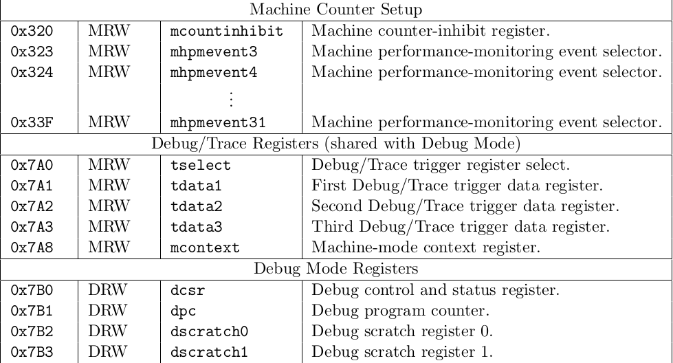

# CSR Design

## Classification of CSR

Overview:

1. Machine information registers

   (1) mvenderid address: 0xF11

   (2) marchid address: 0xF12

   (3) mimpid  address: 0xF13

   (4) mhartid address: 0xF14

   (5) mconfigptr address: 0xF15

   The 5 CSRs must be implemented due to the require of RISC-V. But they cannot be  modified by software. So they can be a constant with initialization.

2. Machine trap setup

   (1) mstatus address: 0x300

   (2) misa address: 0x301

   (3) medeleg address: 0x302

   (4) mideleg address: 0x303

   (5) mie address: 0x304

   (6) mtvec address: 0x305

   (7) mcounteren address: 0x306

   (8) mstatush address: 0x310

   According to the RISC-V privileged spec, (3), (4) and (7) should not be implemented when privileged mode less than M-mode is not implemented. (2) gives an information of ISA to software. In our realization, (2) can be a constant because of our unchangeable ISA structure. (1) and (8) is used to record the status of core. (5) and (6) is used to configure interrupt and exception handling.

3. Machine trap handling

   (1) mscratch address: 0x340

   (2) mepc address: 0x341

   (3) mcause address: 0x342

   (4) mtval address: 0x343

   (5) mip address: 0x344

   (6) mtinst address: 0x34A

   (7) mtval2 address: 0x34B

   According to the RISC-V privileged spec,  (6) and (7) should not implemented only when privileged mode of hypervisor is implemented. The other CSRs is used to record massages when trap is being handled. The CSR and its corresponding massage is shown in the table below.

   |   CSR    |                           massage                            |
   | :------: | :----------------------------------------------------------: |
   | mscratch |    A pointer toward machine-mode hart-local context space    |
   |   mepc   | PC of instruction causes exception or when interrupt happen  |
   |  mcause  |                    The type of trap cause                    |
   |  mtval   | Exception-specific information to assist software in handling the trap, can be all-time zero |
   |   mip    |                      Pending interrupt                       |

   

4. Machine configuration

   (1) menvcfg address: 0x30A

   (2) menvcfgh address: 0x31A

   (3) mseccfg address: 0x747

   (4) mseccfgh address: 0x757

   In this group, (1),(2) is used to control certain characteristics of the execution environment for modes less privileged than M, which should not be implemented according to the spec. When less privileged mode is implemented, these CSRs will be used to configure the execution environment when U-mode is supported. (3), (4) is optional registers for security, will be used when Zkr and Smepmp extension is implemented. So it is not necessary now.

5. Machine memory protection

   (1) pmpcfg0 address: 0x3A0

   (2) pmpcfg1 address: 0x3A1

   ...

   (16) pmpcfg15 address: 0x3AF

   (17) pmpaddr0 address: 0x3B0

   (18) pmpaddr1 address: 0x3B1

   ...

   (80) pmpaddr15 address: 0x3EF

   This group is used to handle physical memory protection. Considering the situation that we have only one hart, i.e. one core, and no privileged mode other than M-mode, this implementation is unnecessary. If we implement more mode or multi-core, physical memory protection may be critical to restrict the user, supervisor( OS )  or some core.

6. Machine non-maskable interrupt handling

   (1) mnscratch address: 0x740

   (2) mnepc address: 0x741

   (3) mncause address: 0x742

   (4) mnstatus address: 0x744

   This group of CSRs are used for non-maskable interrupt defined by platform, functioning the same with previous mentioned ones. The only difference is this group is used for non-maskable ones. Whether this group should be implemented is to be disscussed.

7. Machine counter/time

   (1) mcycle address: 0xB00

   (2) minstret address: 0xB02

   (3) mhpmcounter3 address: 0xB03

   (4) mhpmcounter4 address: 0xB04

   ...

   (31) mhpmcounter31 address: 0xB1F

   (32) mcycleh address: 0xB80

   (33) minstreth address: 0xB82

   (34) mhpmcounter3h address: 0xB83

   (35) mhpmcounter4h address: 0xB84

   ...

   (62) mhpmcounter31h address: 0xB9F

   This is a group of CSRs to record time and instruction for global/software-defined event and is required in M-mode. 

8. Machine counter setup

   (1) mcountinhibit address: 0x320

   (2) mhpmevent3 address: 0x323

   (3) mhpmevent4 address: 0x324

   ...

   (30) mhpmevent31 address: 0x33F

   This is a group of CSRs to control CSRs mentioned in 7

9. Debug/trace

   (1) tselect address: 0x7A0

   (2) tdata1t address: 0x7A1

   (3) tdata2t address: 0x7A2

   (4) tdata3t address: 0x7A3

   (5) mcontextt address: 0x7A8

   (6) dcsrt address: 0x7B0

   (7) dpct address: 0x7B1

   (8) dscratch0t address: 0x7B2

   (9) dscratch1t address: 0x7B3

   This is a group of CSR used for debug and trace. Not sure whether if debug is to implemented in out core.

# Hazard Unit Test Cases

## Flush

1. Single jump instruction
2. Single branch instruction with correct prediction of taken
3. Single branch instruction with wrong prediction of taken
4. Single branch instruction with wrong prediction of non-taken
5. Jump after jump
6. Jalr with bypass signal
7. Jump after  branch instruction with wrong prediction of taken
8. Branch after branch

## Stall

1. Multicycle instruction
2. Data correlation from load instruction

Unfinished Test Case

1. Stall caused by cache miss

   Reason: cache has not implemented

## Bypass

1. Signal bypassed from EX stage
2. Signal bypassed from MEM stage
3. Bypassed signal used in both previous and previous+1 instruction
4. Signal from flushed instruction( which should not be bypassed)

