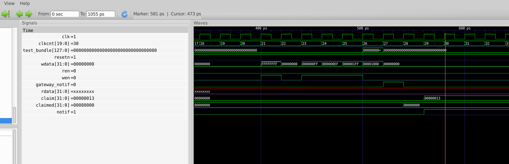
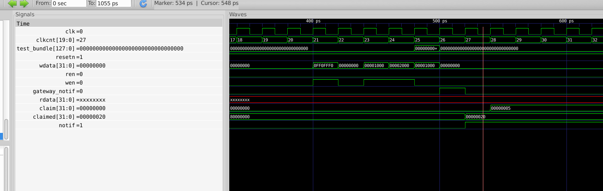
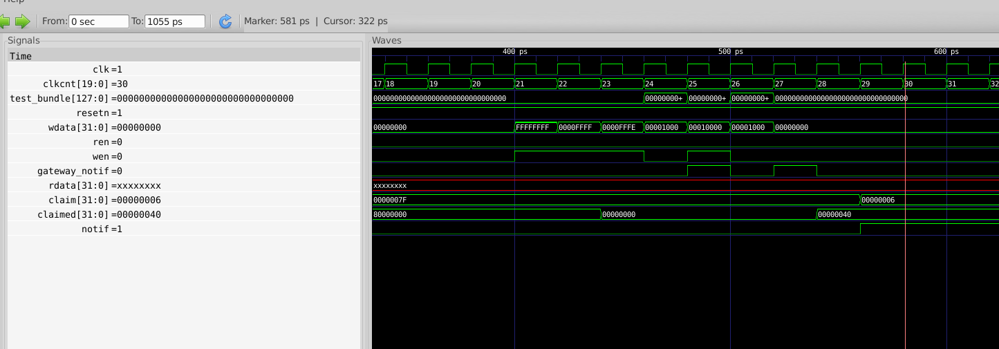
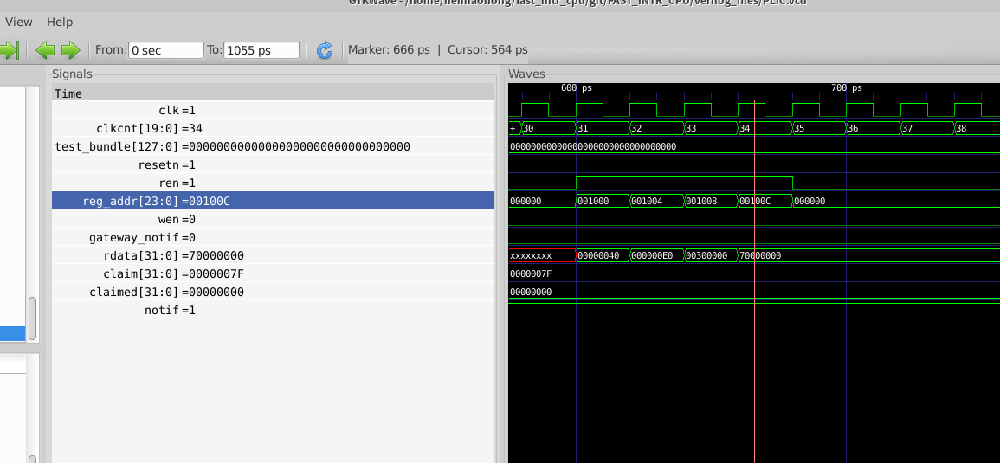
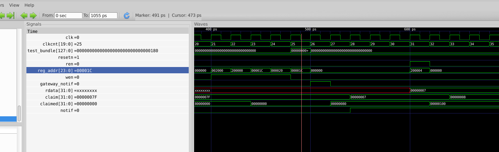
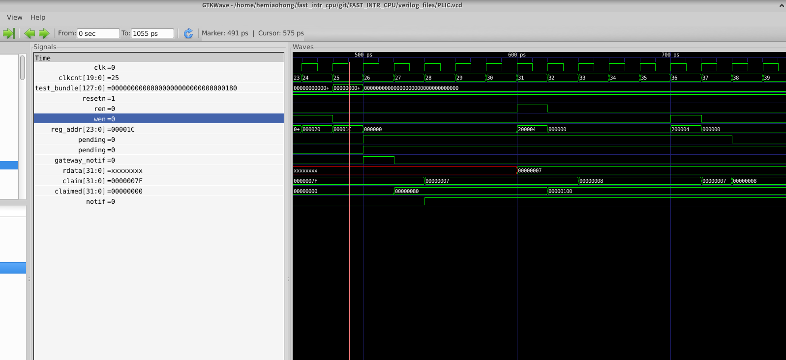

# PLIC Test

## 1. Enable and priority
1. Trigger interrupts with different priorities. As shown in the figure, interrupt with higher priority will be claimed (ID is in claim).

   Here is the input of the test case:

   ID: 0x5

   pri: 0xff

   ID:0x21

   pri:0xef

   ID:0x13

   pri:0x1ff

   

2. Enable and disable some of the interrupt and then trigger them. As shown in the figure and the test vector, interrupt 5 has a lower priority than interrupt 1, but the claim register record 5 because interrupt 1 is not enabled. Here is the test case:

   enable: 0x0ff0fff0

   ID:0x5

   pri:0x1000

   ID:0x1

   pri:0x2000

   

   

## 2. Threshold

Enable all the interrupt and set threshold as 0xffff. Then set the priority of 2 interrupt as 0x10000 and 0xfffe separately. After trigger the 2 interrupt, as shown in the figure, the interrupt with priority of oxfffe does not enter claim because of the threshold but  one with the priority of 0x10000 can enter claim register.

Here is the test case:

enable: 0xffffffff

threshold: 0xffff

ID: 0x5

pri: 0xfffe

trigger 5

ID:0x6

pri:0x10000

trigger 6

## 3. Pending

Pending registers records the current pending external interrupt. Which ever interrupt triggered will be recorded in the pending registers. The registers is read-only registers. As shown in the figure, all pending interrupt can be read from the register

Here is the test case:

trigger 127, 85, 37, 38, 39, 5

read all pending registers

## 4. Claim read

Claim register records the winner of priority arbiter(priority bigger than threshold). When the register is read, corresponding pending bit will be set low. The pending interrupt with next highest priority will be recorded in the register.

Here is the test case:

ID: 0x7

pri: 0xfff0000

ID: 0x8

pri: 0xff00000

trigger 7,8

read claim

## 5. Claim write

Writing claim happens when interrupt handling is going to finish. By doing so, corresponding gateway will be notified to clear interrupt. As shown in the figure, after writing claim, first pending signal(of interrupt 7) pulls down. Also at one cycle after writing, the claim register will be recovered to the winning interrupt.

Here is the test case:

ID: 0x7

pri: 0xfff0000

ID: 0x8

pri: 0xff00000

trigger 7,8

read claim

write claim

