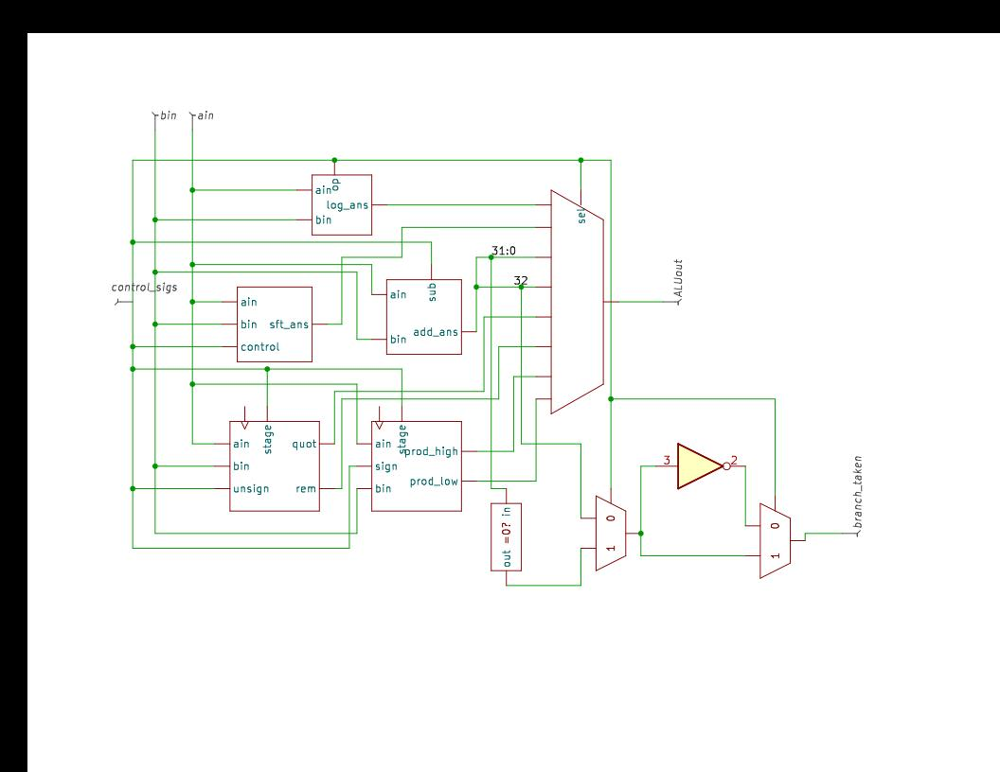
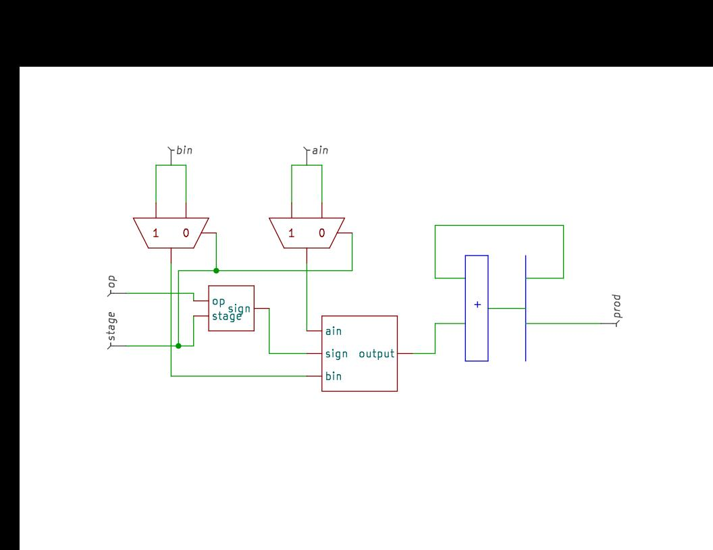
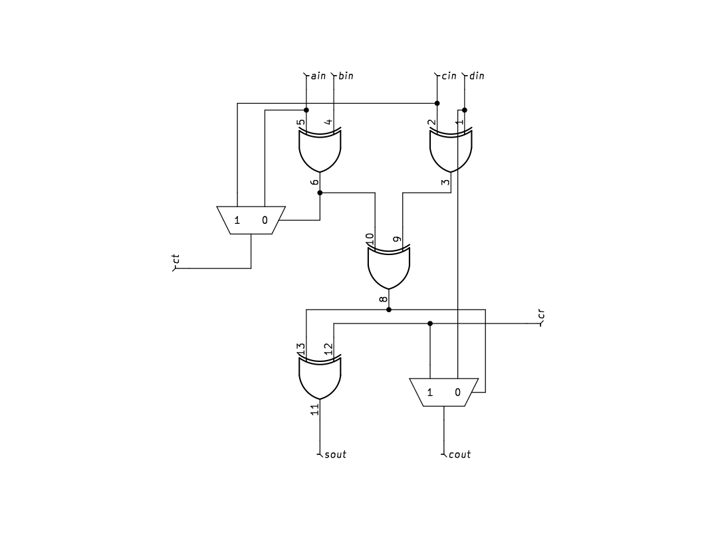
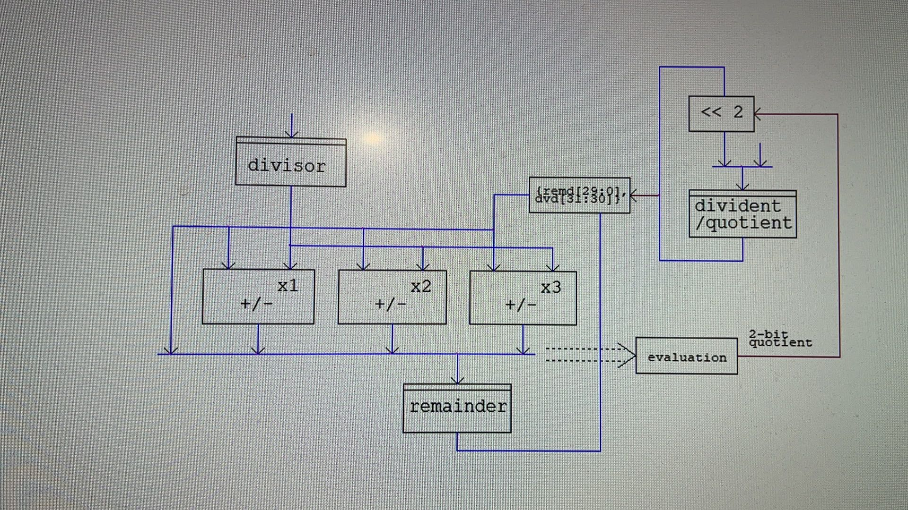
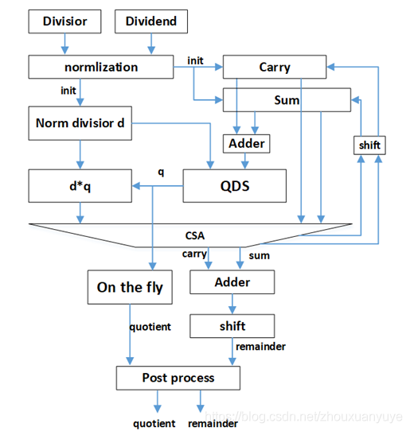

# ALU
## 1. Overall structure
1. Discription

The ALU is used to finish the EX stage in pipeline. Its task includes logical and arithmical calculation and branch disition. The arithmical unit includes adder, shifter, multiplier and diviser. According to the control signal input, ALU will choose the the output of coresponding unit as the output of ALU. Different instruction will cost different cycles to finish. Division will cost 17 cycles. Multiplicationi will cost 4 cycles. The others will cost 1 cycle. For the instructions which cost multiple cycles, control signal will NOT be generated in EX stage to lessen the critical pass.

2. Structure

    

3. signal discription

| name | width| discription|in or out|
|:----:|:----:|:----:|:----:|
|clk|1|clock signal|in|
|ain| 32|operand|in|
|bin|32|operand|in|
|control_sigs|26|control signals of ALU, 18 bits of computaion op,  3 bits of branch control,  2 bits of multiplication stage,   3 bits of division control.|in|
|ALU_out| 32|answer|out|
|branch_taken|1||out|

control_sigs structure:
|position|function|
|:-:|:-:|
0 |add_op
1  |sub_op
2  |sll_op
3  |srl_op
4  |sra_op
5  |or_op
6  |and_op
7  |xor_op
8  |slt_op
9  |sltu_op
10 |mul_op
11  |mulh_op
12  |mulhsu_op
13  |mulhu_op
14  |div_op
15  |divu_op
16  |rem_op
17  |remu_op
18  |beq
19  |blt
20  |branch
21~22| multiplicaiton stage
23~25| division control

## 2.Logical unit design

1. function

Logical Unit is used to handled the Logical instructions. 

2. realization

The relationship of answer of each logical instruction and operand is shown as below
$$
and\_ ans= a\wedge b\\
or\_ ans= a\vee b\\
xor\_ ans= a\oplus b
$$
Notice that 
$$
 a\vee b=(a \oplus b)\vee (a\wedge b)
$$

In order to reduce the total amont of gates, logical answer will be given by 
$$
log\_ ans=((a\oplus b)\wedge b(xor\_ op\vee or\_ op))\vee ((a\wedge b)\wedge b(and\_ op\vee or\_ op)) 
$$

2. signal discription

| name | width| discription|in or out|
|:----:|:----:|:----:|:----:|
|ain| 32|operand|in|
|bin|32|operand|in|
|op|3|xor_op, or_op, and_op|in|
|log_ans| 32|answer|out|

## 3.Addition unit design

1. function

The addition unit is used to handle add, sub, slt and sltu instructions. 

2. realization

As is known, subtraction such as $a-b$ in computer is handled as $a+b_{comp}$, in which $b_{comp}=\bar{b}+1$. As a consequence, to reuse adder,  the answer of add and sub can be discribed as follow
$$
add\_ ans=a+b\oplus sub +sub 
$$
The answer of slt and slt is discribed as: 
$$
slt\_ ans=\begin{cases}
   1 &\text{if } a<b \\
   0 &\text{if } a>b
\end{cases}
$$
To judge whether a is less than b, subtraction is needed. So the adder can be reused to handle slt and sltu instructions. Also we can notice that the slt_ans is the same as sign bit of the subtraction answer. So we can rewrite the term above as:
$$
add\_ ans=a+b\oplus (sub\vee slt\vee sltu) +(sub\vee slt\vee sltu)
$$
With the term above, we can use the sign bit, or called as MSB, as the answer of slt or sltu. Also, to get the sign bit of 32-bit unsigned number, a and b will be extended to 33 bit with the extended bit given by 
$$
MSB\wedge (\bar{sltu\_ op})
$$

3. signal discription

| name | width| discription|in or out|
|:----:|:----:|:----:|:----:|
|ain| 32|operand|in|
|bin|32|operand|in|
|sub|3|sub_op, slt_op, sltu_op|in|
|add_ans| 33|answer|out|

## 4.Multiplication unit design

1. function

Multiplication unit is to handle instructions include mul, mulh, mulhsu and mulhu, and will use 4 cycles to get the answer. 

2. realization

2.1. overall of multiplication

Multiplicaiton is a operation cost big amount of time and gates. In order to reduce the critical path, the multiplicand and the multiplier will be divided into 2 part separately according to 
$$
(a+b)\cdot (c+d)= ac+bc+ad+bd
$$
So we can use 4 cycles to do a 16bits*16bits multiplication each cycle. From the second cycle, the answer will be added with the previous sum. In this way, we will only use about 1/4 of the gates and reduce at least 1 layer of compressor's latency. The multiplier struction is as below:

2.2. 16*16

In each 16bits*16bits multiplication, the 3 bits booth encoding and 4-2 compressors will be used. The structure of 4-2 compressor is shown as below:

3 bits booth encoding uses the table below:
|x+1|x|x-1|output|
|:-:|:-:|:-:|:-:|
|0|0|0|0|
|0|0|1|1|
|0|1|0|1|
|0|1|1|2|
|1|0|0|-2|
|1|0|1|-1|
|1|1|0|-1|
|1|1|1|0|

Notice that the booth encoding is designeg for signed multiplication. So when we need unsigned multiplication, 2 bits of 0 is to be extended. 

Besides, because we separate a 32-bit multiplication into 4 16-bit multiplication, a signed number should be specially handled to make the total answer right. The relationship of multiplicand and multiplier and their compliment is:
$$
a=-2^{31}*a_{31+}\sum_{i=0}^{30} a_i*2^i\\
b=-2^{31}*b_{31+}\sum_{i=0}^{30} b_i*2^i
$$
So when we separate, we have:
$$
a*b=(-2^{31}*a_{31}+\sum_{i=0}^{30} a_i*2^i)(-2^{31}*b_{31}+\sum_{i=0}^{30} b_i*2^i)\\
=(-2^{31}*a_{31}+\sum_{i=16}^{30} a_i*2^i)(-2^{31}*b_{31}+\sum_{i=16}^{30} b_i*2^i)+(\sum_{i=0}^{15} a_i*2^i)(-2^{31}*b_{31+}\sum_{i=16}^{30} b_i*2^i)+\\
(-2^{31}*a_{31+}\sum_{i=16}^{30} a_i*2^i)(\sum_{i=0}^{15} b_i*2^i)+(\sum_{i=0}^{15} a_i*2^i)(\sum_{i=0}^{15} b_i*2^i)
$$
As a consequence, when we do a signed*signed multiplication, we actually do signed*signed, signed*unsigned, unsigned*signed and unigned*unsigned in our multiplier.
    
The booth encoding will generate 9 17bits adders with 8 sign bits(the sign of the 9th adder is ignored). To decrease the addition caused by sign extension, operation below will be done:
    $$
    \sum_{i=0}^{8} \sum_{j=17+2i}^{31}sign_i*2^j \\
    =\sum_{i=0}^{8}(2^{32}-sign_i*2^{17+2i})\\
    =8*2^{32}+\sum_{i=0}^{8}(\bar{sign_i}*2^{17+2i})+\sum_{i=0}^6(2^{18+2i})+2^{17}
    $$

The sign of the whole product of 16*16 will be given as below:

$$
sign=ss(a[15]\oplus b[15])+su\cdot a[15]+us\cdot b[15]
$$

in which ss, su and us mean sign* sign, sign* unsign and unsign * sign separately.

3. signal discription

| name | width| discription|in or out|
|:----:|:----:|:----:|:----:|
|clk|1|clock signal|in|
|ain| 32|operand|in|
|bin|32|operand|in|
|sign|3|uu, su or ss|in|
|stage|2|given by IF|in|
|prod_high|32|answer|out|
|prod_low|32|answer|out|

4. further extention
   

When higher speed of multiplication is needed, more 16*16 multiplier can be implemented to reduce the cycle to calculate multiplication.
## 5.Division unit design

1. function

The division unit is used to handle instructions include div, divu, rem and remu, and will use 17 cycles to get the answer. 

2. realization

Considering the characteristic of division, in which distributive law cannot be applied to diviser, computation of division cannot be symplified as multiplication above. So the division must be done bit by bit. As a consequence, we use long division to compute division. The strcuture is shown as below:

When division start, a series of comparison will be done to determine the sign of quotion and handle divided-by-zero situation. Meanwhile dividend and divisor will be saved for comming calculaiton. Also, partial remainder will be initialied as 35 bits(prevention of overflow) of dividend sign. After that, in each cycle, 2 bits of quotion will be generated. 3 temporal remainder will be generated by doing subtraction of partial remainder and 1, 2 or 3 times of divisor. Espacially subtraction of partial remainder and 3 times of divisor will be done with CSA to limit the overhead. By comparing the signs of temporal remainder and dividend, 2 bits of quotion will be determined in the form of 1's complement. The generated quotion will be saved at the last 2 bits(lest significant 2 bits) of dividend. Same operation will iterate 16 times to get all 32 bits of quotion. In the 17th cycle, the quotion will be converted to 2's complement. 

3. signal discription

| name | width| discription|in or out|
|:----:|:----:|:----:|:----:|
|clk|1|clock signal|in|
|ain| 32|dividend|in|
|bin|32|divisor |in|
|unsign|1|if unsign division|in|
|stage|3|init, advance and last,  given by IF|in|
|quot|32|quotion|out|
|rem|32|remainder|out|

4. further extension

With the realization above, we need to do subtraction every cycle, which causes big overhead to generate quotion. Using SRT as follow may allows to generate 4 bits per cycle because only CSA will used before the last cycle. 

But meanwhile the energy and area cost will increase. So SRT solution may be used when word length become 64 or be used in cooperator to do division of long word.

## 6. Shift unit design

to be filled by fujie's document

## 7.To handle branch instructions

The judge of whether the branch is taken is also done in EX stage. In RISC-V instruction, there are 6 kind of branch instrction. They are blt, bge, bltu, bgeu, bne and beq. All of these need comparison between 2 operand. The comparison will be done by reuse subtraction, i.e. the addition unit above. The branch_taken signal can be expressd by:
$$
branch\_taken=((blt\vee bltu)\wedge add\_ans[32])\vee((bge\vee bgeu)\wedge \bar{add\_ans[32]})\\
\vee( bne\wedge( \bar{add\_ans!=0}))\vee( beq\wedge( \bar{add\_ans==0}))
$$
Its not hard to notice that the answer has a close relationship with the answer of slt, sltu and sub. Also because the answer of blt, bltu and beq and the answer of bge, bgeu and bne is opposite, the branch signal of bge, bgeu and ben can be generated by simply inverse the signal of blt, bltu and beq. As a consequence, the branch_taken signal can be reformed as below:
$$
branch\wedge((sub\_op \wedge(beq\odot(add_ans==0)))\vee	((slt\_op\vee sltu\_op)\wedge(blt\odot(add\_ans[32]))))
$$
In this way, less signal can be used to finish branch instructions, concluding in less power and area with little overhead. The signals of each branch instrction is shown as below:

|type| signals|
|:-:|:-:|
beq |branch, beq, sub
bne |branch, sub
blt |branch, blt, slt
bltu|branch, blt, sltu
bge |branch, slt
bgeu|branch, sltu

