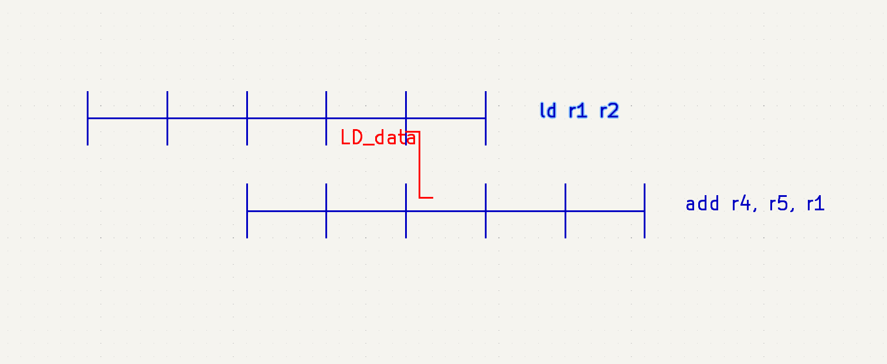

# Harzard Unit

## Bypass
1. Motivation

To make sure MCU get correct answer, in a pipelined MCU, latter instruction with correlation need to wait for former instructions answer sometime because the source regster may not be written when needed. These situations will cause a decrease of MCU's throughput. To limit the decrease, bypass is used to transfer data before it goes into regsterfile. 

2. Different situations using bypass

In this section, situations which need stall will not be discussed.

2.1.  

As shown as the figure above, when the destination register of the first instrction is a resource of the second instruction and the first instruction is no a load instruction or a multicycle instruction, the resouce will be given directly from EX/MEM register.

2.2.  

As shown as the figure above, when the destination register of the first instrction is a resource of the third instruction and the first instruction is noy a load instruction or multicycle instruction, the resouce will be given directly from MEM/WB register.

2.3.  

As shown as the figure above, when the destination register of the first instrction is a resource of the third instruction and the first instruction is a load instruction, the loaded data will be given directly from MEM/WB register.

3. Design of bypass

From the discusstion above and the ISA of RISC-V, the source of operation 1 can be MEM-EX bypass, WB-EX bypass and register file, and the source of operation 2 can be MEM-EX bypass, WB-EX bypass, immidiate number and register file. The hazard unit is responsible for selection of the sources. To do so, the destination of latest 2 instruction will be stored(answer of former instructions has gone into register file). The sourece register of comming instruction will be compared with saved destination. If they are the same, bypassed data will be selected in EX stage. The selection signal can be expressed as follow:
$$
s\_1\_sel[0]=s1==d_{-2}\\
s\_1\_sel[1]=s1==d_{-1}\\
s\_2\_sel[0]=s2==d_{-2}\\
s\_2\_sel[1]=s2==d_{-1}
$$

## Stall

1. Motivation

Some hazard connot be solved by only using bypass. To make sure pipeline can work correctly, instruction need to be stalled to get correct data. Stall may caused by multi-cycle instrction, memory access issue, i.e. cache miss, or instrction correlation. For correlation, instruction will stall for certain number of cycles. For cache missed, instruction will stall for uncertain number of cycles. 

2. Different situations using stall 

    2.1. Cache miss

    (1) IF cache miss

    

    As shown in the figure, IF cache miss will cause stall of IF/ID register. The stall will last until instruction's arrival. Instructions before then will keep going in pipeline. 

    (2) load/store cache miss

    

    As shown in the figure, load/store cache miss will cause stall of IF/ID, ID/EX and EX/MEM register. The stall will last until instruction's arrival. Instructions before then will keep going in pipeline.

    2.2. Data correlation

    

   As shown in the figure, load date correlation will cause 1 cycle of stall when loaded data is used in the next instruction. IF/ID register and ID/EX register will stall. Instructions before the correlation will keep going in pipeline. 
   
   
   
   2.3. Multi-cycle instructions
   
   
   
   
   
    As shown in the figure, multi-cycle instructions will cause several cycles of stall depending on the type of instruction. Because control signals of multi-cycle instruction are generated in ID stage, only IF/ID register will stall. Instructions before the correlation will keep going in pipeline.

​	

3. Design of stall

    For stall caused by cache miss, when accepting a cache miss signal from data or instruction cache, hazard unit will send stall signal to corresponding pipeline register disscussed above.
    For stall caused by load data correlation, when a load instruction is decoded, the destination register stored for bypass will be flaged. If the flaged register is used in the next instruction as a source register, instructions following will be stalled as disscussed aboce.
    For multi-cycle instruction, when decoder find a multi-cycle instrucion, hazard unit will be told its type. The IF/ID register stall signal will be high until decoder give a finish signal.

## Pipeline flush 

1. Motivation

When branch signals or jump signals show up in the instruction flow, they will not be known as branch or jump signals until their ID stage finish. Additionally, for the branch signals, whether the branch taken will be known after their EX stage finish( prodiction result will be known when ID stage finish). As a consequence, instructions that should not appear in execution flow will be fetched. To ensure the correct excution, some instructions should be flushed.

2. Different situations using pipeline flush

    2.1. Jump

    

    When jump signal is decoded, a signal of instruction type will be sent to hazard unit. As shown in the figure above, the next instruction in the figure will be flushed. If it is a single cycle instruction, its result will not be written back. Its data will not be bypassed either. If it is a multi-cycle instruction, finish signal will be sent immidiately. Same as single cycle instruction, its answer will not be bypassed or written back either.

    2.1. Branch

    (1) Pridicted taken

    

    When branch signal is decoded, signal of instruction type and prediction result will be sent to hazard unit. As shown in the figure above, when the EX stage of branch signal finished, whether the branch taken will be sent to hazard unit. If prediction is correct, the next instruction in the figure will be flushed. If pridiction is wrong, the target instruction in the figure will be flushed. The operation of flush is the same as that in the Jump section.

    (2) Pridicted not taken but wrong

    

    When branch signal is decoded, signal of instruction type and prediction result will be sent to hazard unit. As shown in the figure above, when the EX stage of branch signal finished, the branch taken signal will be sent to hazard unit. The target instruction in the figure will be fetched in the next cycle. The next instruction and next+1 instruction in the figure will be flushed. When target instruction is next+1 instruction,  next+1 instruction will still be flushed to simplify the control of pipeline flush. The operation of flush is the same as that in the Jump section.

    (2) Pridicted not taken and correct

    

    As shown in the figure above, no instruction will be flushed.

3.  Design of pipeline flush

    Hazard unit will receive instruction type when branch instructions or jump instructions are decoded. Also, the prediction result and real result of branch instruction will be sent to hazard unit. With the signals received, pipeline flush signals will be sent to correspond stage and unit as discussed above. The signals includes multi-cycle instruction finish signal, write-back prevention and bypass ignore signal.