# Hazard Test of Branch and Jump	


## Pipeline flush 

1. Jump

   (1) JAL

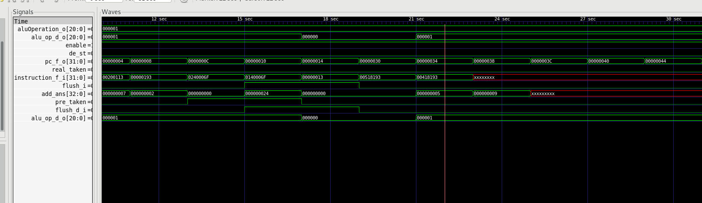

When jump instruction is decoded, a signal of instruction type will be sent to hazard unit. As shown in the figure above, the next 2 instructions in the figure will be flushed.  The jump signal flushed will not influence the function of pipeline. The instructions input is shown as below.

	.global _boot
	.text
	
	_boot:                   
	    addi x1 , x0,   7  
	    addi x2 , x0,   2 
	    addi x3 , x0,	0
	    jal  x0,	 _flag
	    jal  x0,	 _f0
	    addi x3 , x0,   1  
	    addi x3,  x3,   3
	    addi x3,  x3,   2
	    addi x3,  x3,   3
	_f0:
	    addi x3,  x3,   2
	    addi x3,  x3,   3
	    addi x3,  x3,   2
	_flag:
	    addi x3,  x3,   5
		addi x3,  x3,   4

(2) JALR with bypass

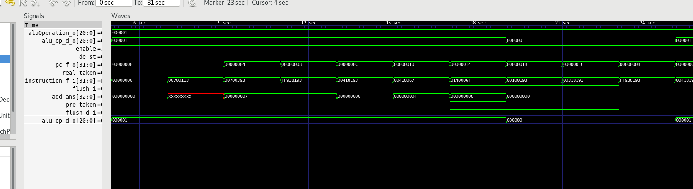

When jalr instruction is decoded and correlation was found, a signal of instruction type and a signal of correlation will be sent to hazard unit. As shown in the figure above, the next 3 instructions in the figure will be flushed, because the direction of jalr will be generated in EX stage.  The jump signal flushed will not influence the function of pipeline. The instructions input is shown as below.

	.global _boot
	.text
	
	_boot:                    
	    addi x2 , x0,   7  
	    addi x7 , x0,   7  
	    addi x3 , x7,	-7
	    addi x3, x3,  4
	    jalr  x0, 	 4(x3)
	    jal  x0,	 _f0
	    addi x3 , x0,   1  
	    addi x3,  x3,   3
	    addi x3,  x3,   2
	    addi x3,  x3,   3
	    


2. Branch

(1) Predicted taken

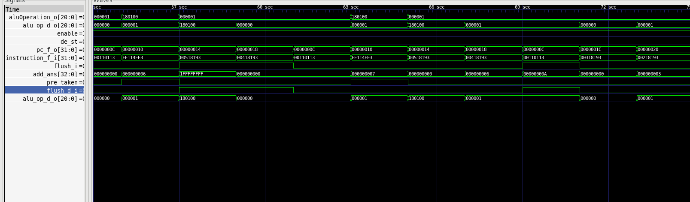

When the PC destination of a branch instruction is smaller than the PC of branch instruction itself, the branch signal will be predicted taken in ID stage. If the prediction is correct, 2 next instruction will be flushed due to the IF design. If the prediction is wrong, the third instruction will be flushed. As is shown in the figure, the flush signal functioned as expected. And after the flush signal, the output of ID/EX stage register will be all 0, which means it become a NOP instruction. The instructions input is shown as below.

		.global _boot
		.text
	
	_boot:             
	    addi x1 , x0,   7  
	    addi x2 , x0,   0 
	    addi x3 , x0,   1  
	_flag:
		addi x2, x2,   1
	    blt x2,	x1,	 _flag
	    addi x3,  x3,   5
		addi x3,  x3,   4


(2) Predicted not taken but wrong

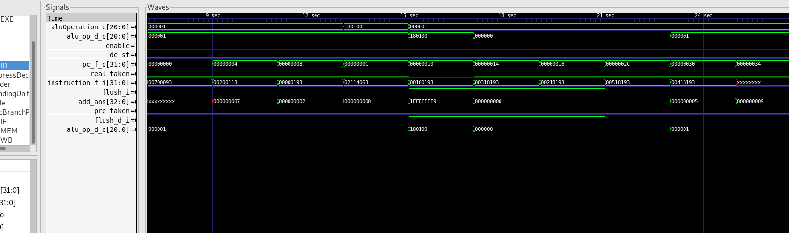

When the PC destination of a branch instruction is bigger than the PC of branch instruction itself, the branch signal will be predicted not taken in ID stage. If the prediction is correct, no flush will happen in the flow. If the prediction is wrong, the next 3 instruction will be flushed. As is shown in the figure, the flush signal functioned as expected. And after the flush signal, the output of ID/EX stage register will be all 0, which means it become a NOP instruction. The instructions input is shown as below.

	.global _boot
	.text
	
	_boot:                    
	    addi x1 , x0,   7  
	    addi x2 , x0,   2 
	    addi x3 , x0,	0
	    blt x2,	x1,	 _flag
	    addi x3 , x0,   1  
	    addi x3,  x3,   3
	    addi x3,  x3,   2
	    addi x3,  x3,   3
	    addi x3,  x3,   2
	    addi x3,  x3,   3
	    addi x3,  x3,   2
	_flag:
	    addi x3,  x3,   5
		addi x3,  x3,   4

3. Wrong prediction and jump

   ​	 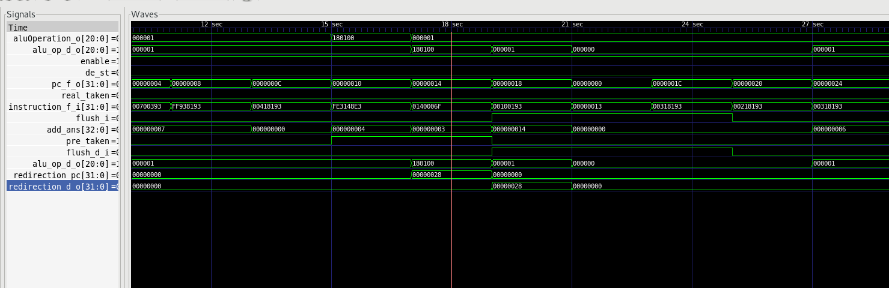

When a jump instruction is after a wrong prediction, i.e. the jump instruction is predicted not happen but actually happen, the instruction flush functions normally but the PC redirection cannot be generate correctly. As shown in the figure above, the wrongly predicted instruction is flushed but PC do not go to the correct place. The problem need to be fixed with Fu Jie in the next week. The instructions input is shown as below.

```
.global _boot
.text

_boot:                 
    addi x2 , x0,   7  
    addi x7 , x0,   7  
    addi x3 , x7,	-7
    addi x3, x3,  4
    blt x2, x3,	_boot
    jal  x0,	 _f0
    addi x3 , x0,   1  
    addi x3,  x3,   3
    addi x3,  x3,   2
    addi x3,  x3,   3
_f0:
    addi x3,  x3,   2
    addi x3,  x3,   3
    addi x3,  x3,   2


```

# CSR Design

## Brief Introduction of CSR

 1. misa

    The register to show ISA of the core. The structure is as below:

    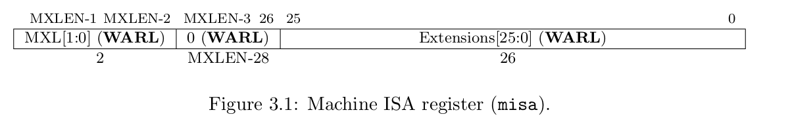

    MXL=1 when its 32 bit system, extensions table is as below:

    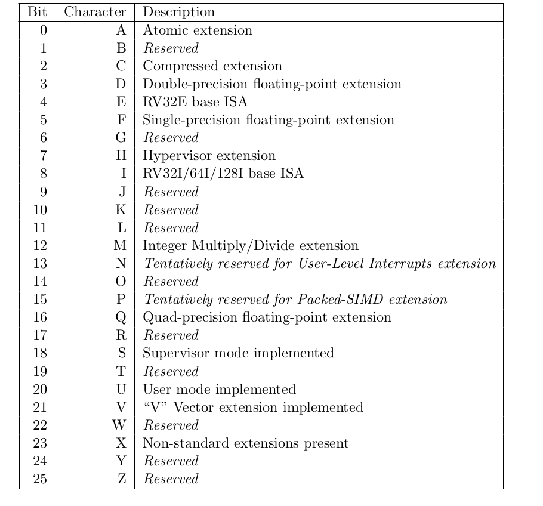

 2. mvenderid

    The register to identify vendor

    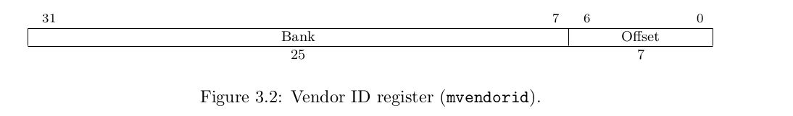

 3. marchid

    The register to identify architecture

    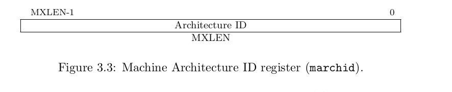

 4. mimpid

    The register to identify architecture

    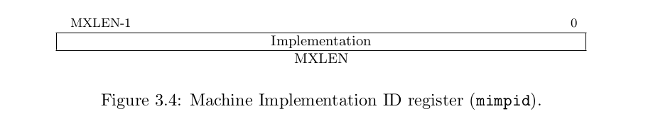

 5. mhartid

    The register to identify hardware thread (core)

    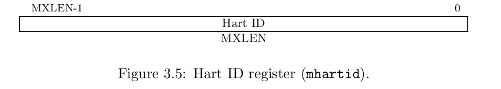

 6. mstatus& mstatush

    The mstatus and mstatush register keeps track of and controls the hart’s current operating state. Their structures are shown as below:

    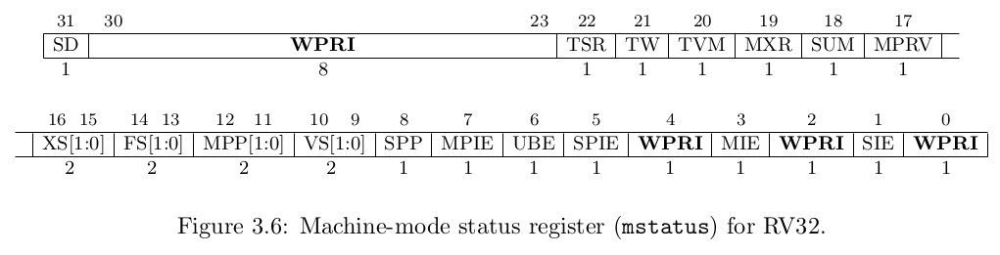

    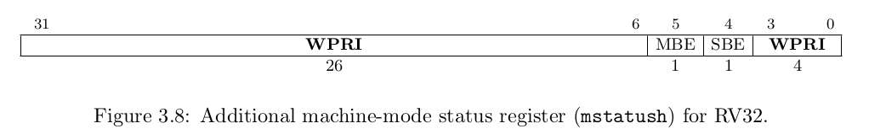

    |   name   |                           function                           |
    | :------: | :----------------------------------------------------------: |
    |   xIE    |              global interrupt enable in x mode               |
    |   xPIE   |         prior interrupt enable for nested interrupt          |
    |   xPP    |                   previous privilege mode                    |
    |   xBE    |                      memory endianness                       |
    | FS/VS/XS |                 float/vector/extension CSRs                  |
    |   MPRV   |       Modified privilege, 0 if U-mode not implemented        |
    |   SUM    |             permit Supervisor User Memory access             |
    |   MXR    | Make eXecutable Readable,has no effect when page-based virtual memory is not in effect. |
    |   TVM    | Trap Virtual Memory,TVM is<br/>read-only 0 when S-mode is not supported. |
    |    TW    | Timeout Wait, read-only 0 when there are no modes less privileged than M. |
    |   TSR    |     Trap SRET, read-only 0 when S-mode is not supported      |
    |    SD    |                  summarize of FS, VS and XS                  |

 7. mtvec

    holds trap vector configuration, consisting of a vector base address (BASE) and a vector mode (MODE). Mode=0 for all exceptions set PC to BASE and MODE=1 for asynchronous interrupts set pc to BASE+4×cause.

    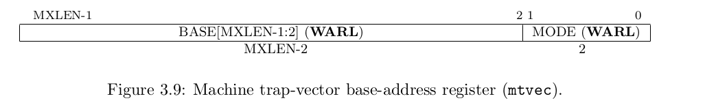

 8. me/ideleg

    In systems without S-mode, the medeleg and mideleg registers should not exist.

 9. mip/mie

    mip register is a register containing information on pending interrupts,
    mie is the corresponding register containing interrupt enable bits.

    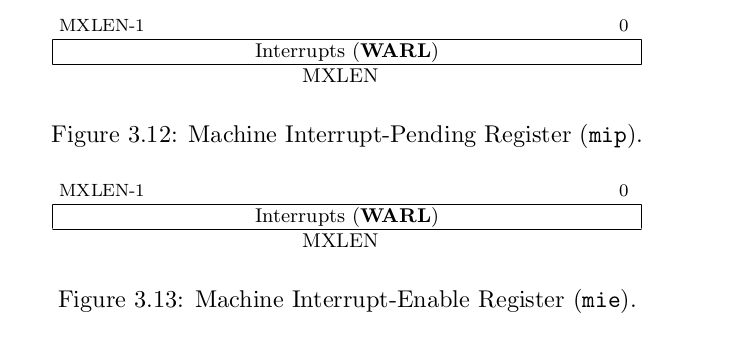

 10. mcycle, minstret and mhpmevent(h)

     The mcycle CSR counts the number of clock cycles executed by the processor core on which the hart is running. The minstret CSR counts the number of instructions the hart has retired. The mcycle and minstret register have 64-bit precision on all RV32 and RV64 systems. The hardware performance monitor includes 29 additional 64-bit event counters, mhpmcounter3–mhpmcounter31.

     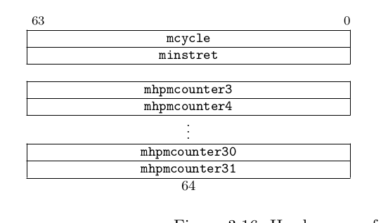

 11. mcounteren

     In systems without U-mode, the mcounteren register should not exist.

 12. mcounterinhibit

     controls which of the hardware performance-monitoring counters increment. When the CY, IR, or HPMn bit in the mcountinhibit register is clear, the cycle, instret, or hpmcountern register increments as usual. When the CY, IR, or HPMn bit is set, the corresponding counter does not increment.

     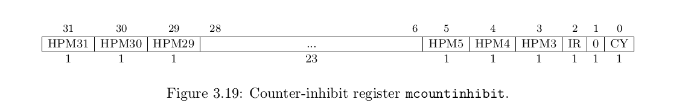

 13. mscratch

     hold a pointer to a machine-mode hart-local context space and swapped with a user register upon entry to an M-mode trap handler.

     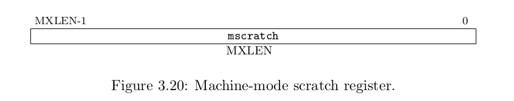

 14. mepc

     When a trap is taken into M-mode, mepc is written with the virtual address of the instruction that was interrupted or that encountered the exception. Otherwise, mepc is never written by the implementation, though it may be explicitly written by software.

     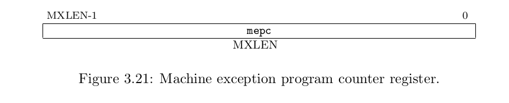

 15. mcause

     When a trap is taken into M-mode, mcause is written with a code indicating the event that caused the trap. Otherwise, mcause is never written by the implementation, though it may be explicitly written by software.

     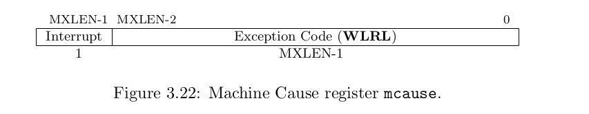

     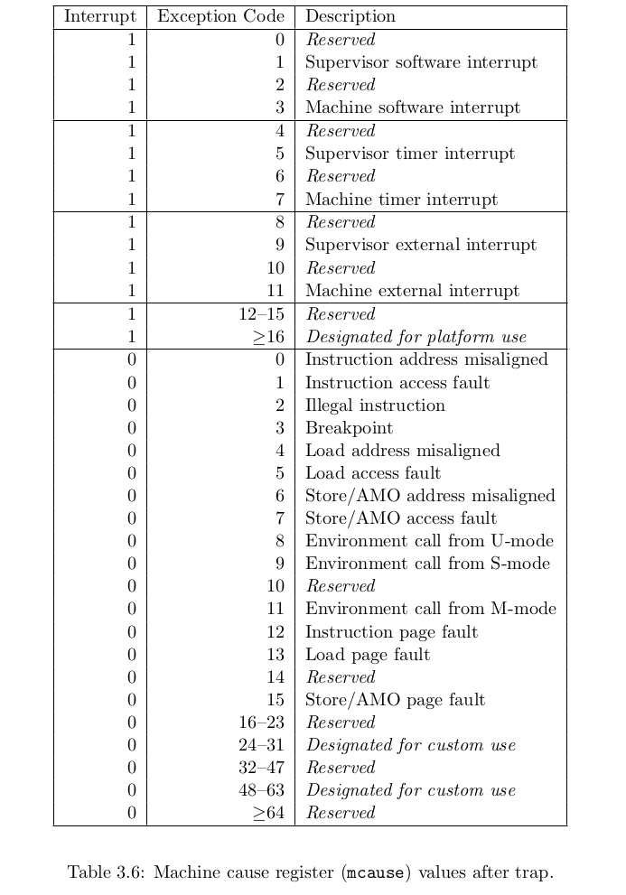

 16. mtval

     When a trap is taken into M-mode, mtval is either set to zero or written with exception-specific information to assist software in handling the trap. Otherwise, mtval is never written by the implementation, though it may be explicitly written by software. The hardware platform will specify which exceptions must set mtval informatively and which may unconditionally set it to zero.

     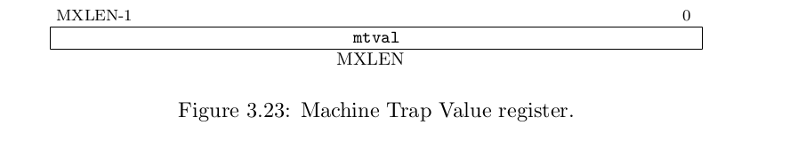

 17. mconfigptr

     holds the physical address of a configuration data structure. Software can traverse this data structure to discover information about the harts, the platform, and their configuration.

     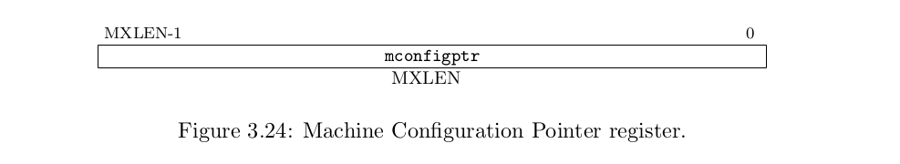

 18. menvcfg(h)

     Controls certain characteristics of the execution environment for modes less privileged than M. If U-mode is not supported, then registers menvcfg and menvcfgh do not exist.

 19. mseccfg

     Optional, not necessary now.

 20. mtime/mtimecmp

     Platforms provide a real-time counter, exposed as a memory-mapped machine-mode read-write register, mtime. mtime must increment at constant frequency, and the platform must provide a mechanism for determining the period of an mtime tick. The mtime register will wrap around if the count overflows.
     The mtime register has a 64-bit precision on all RV32 and RV64 systems. Platforms provide a 64-bit memory-mapped machine-mode timer compare register (mtimecmp). A machine timer interrupt becomes pending whenever mtime contains a value greater than or equal to mtimecmp, treating the values as unsigned integers. The interrupt remains posted until mtimecmp becomes greater than mtime (typically as a result of writing mtimecmp). The interrupt will only be taken if interrupts are enabled and the MTIE bit is set in the mie register.

     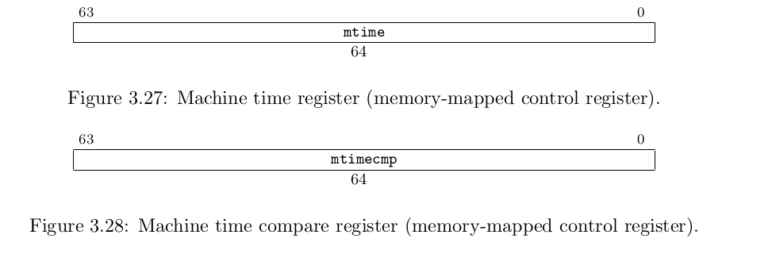

 21. pmpcfg

Physical memory protection, not necessary now.