# Hazard Test

## Bypass
1. 
   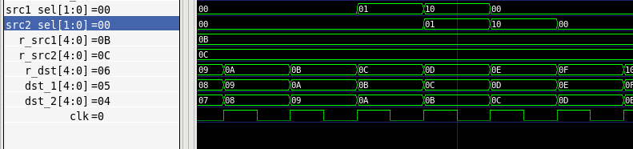

In this situation, basic bypass signal is tested. The figure above shows that when source register is the same with the destination register of previous one or two instruction, correct data will be bypassed with the src1_sel or src2_sel signal. 

2. 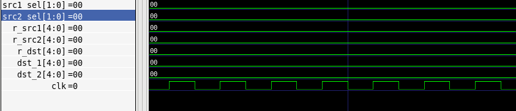

In this situation, when source register is r0, bypass will not happen. The reason is that r0 will always be zero.

3. 
   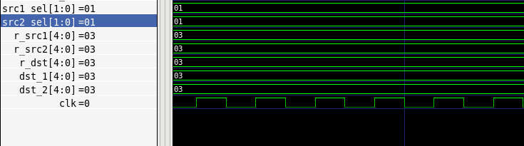

In this situation, the destination register of previous one and two instruction is the same. To get correct data for coming instruction, the data of previous one instruction should be selected. As a consequence, src1_sel or src2_sel wil be 01 to select correct data.

## Stall

1. Cache miss

(1) IF cache miss

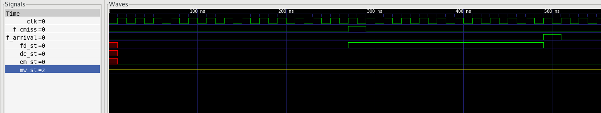

As shown in the figure, IF cache miss will cause stall of IF/ID register. The stall will last until instruction's arrival. Instructions before then will keep going in pipeline. When data from memory arrives, stall will be canceled.

(2) load/store cache miss

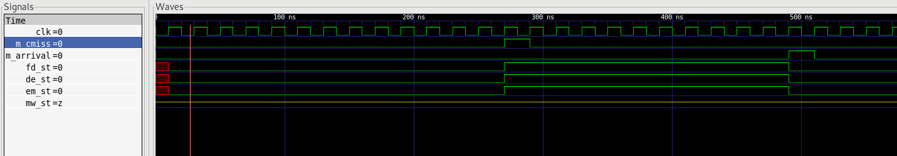

As shown in the figure, load/store cache miss will cause stall of IF/ID, ID/EX and EX/MEM register. The stall will last until instruction's arrival. Instructions before then will keep going in pipeline. When data from memory arrives, stall will be canceled.

2. Data correlation

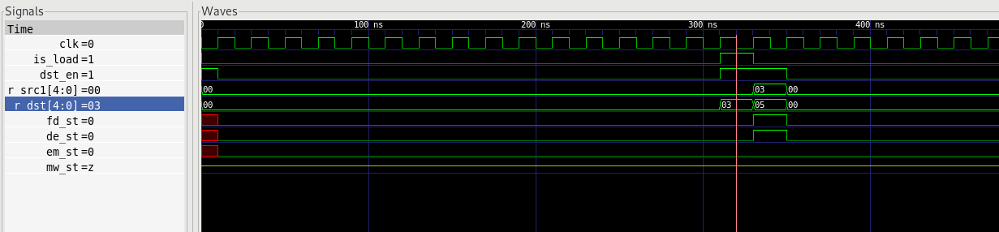

As shown in the figure, load date correlation will cause 1 cycle of stall when loaded data is used in the next instruction. IF/ID register and ID/EX register will stall. Instructions before the correlation will keep going in pipeline. 

3. Multi-cycle instructions

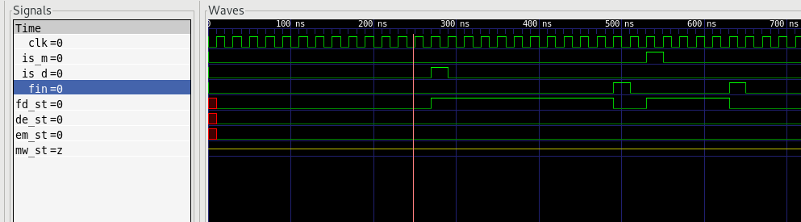

 As shown in the figure, multi-cycle instructions will cause several cycles of stall depending on the type of instruction. Because control signals of multi-cycle instruction are generated in ID stage, only IF/ID register will stall. Instructions before the correlation will keep going in pipeline. When fin signal is generated from ID stage, stall will be canceled.

​	

## Pipeline flush 

1. Jump

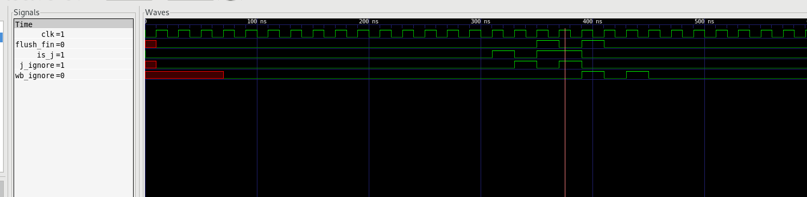

When jump signal is decoded, a signal of instruction type will be sent to hazard unit. As shown in the figure above, the next instruction in the figure will be flushed. If it is a single cycle instruction, its result will not be written back. Its data will not be bypassed either. If it is a multi-cycle instruction, finish signal by hazard unit (flush_fin) will be sent immediately. Same as single cycle instruction, its answer will not be bypassed or written back either. If the next instruction is also a jump instruction, it will be ignored both in hazard unit and pipeline.

2. Branch

(1) Predicted taken

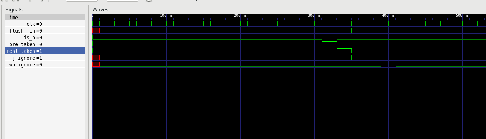

When branch signal is decoded, signal of instruction type and prediction result will be sent to hazard unit. As shown in the figure above, when the EX stage of branch signal finished, whether the branch taken will be sent to hazard unit. If prediction is correct, the next instruction will be flushed the same way as jump instruction. If prediction is wrong, the target instruction in the figure will be flushed. The operation of flush is the same as that in the Jump section.

(2) Predicted taken but wrong

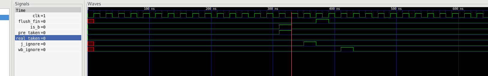

When branch signal is decoded, signal of instruction type and prediction result will be sent to hazard unit. As shown in the figure above, when the EX stage of branch signal finished, whether the branch taken will be sent to hazard unit.  If prediction is wrong, the target instruction will be flushed. The operation of flush is the same as that in the Jump section.

(2) Predicted not taken but wrong

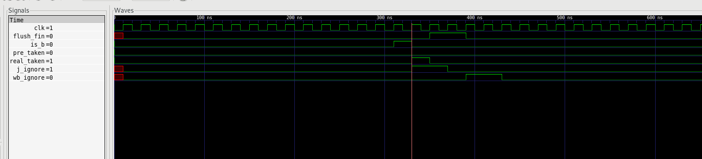

When branch signal is decoded, signal of instruction type and prediction result will be sent to hazard unit. As shown in the figure above, when the EX stage of branch signal finished, the branch taken signal will be sent to hazard unit. The target instruction in the figure will be fetched in the next cycle. The next instruction and next+1 instruction in the figure will be flushed. When target instruction is next+1 instruction,  next+1 instruction will still be flushed to simplify the control of pipeline flush. The operation of flush is the same as that in the Jump section, but every signal will last for 2 cycles.

# Combination of flush and bypass

 When flush happen, bypass signal will be generated as shown below. The result of flushed instruction will not be bypassed.

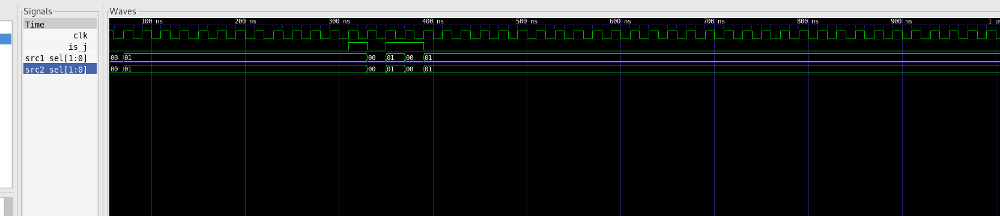

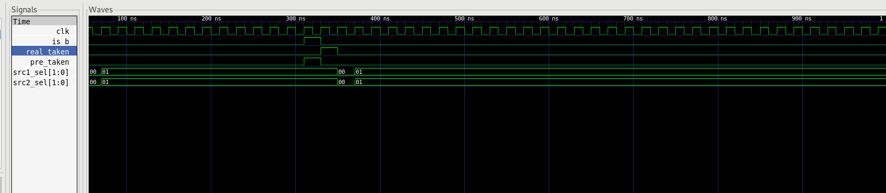

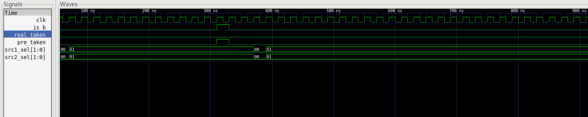

# Combination of flush and stall

When a instruction is flushed, j_ignore will be generated in its ID stage. With this signal, memory access will not happen in its MEM stage. So no Dcache miss will happen within the instruction. Also, flush_fin signal will terminate the execution of multi-cycle instruction. The only stall could happen is caused by Icache miss, which is not specially handled.