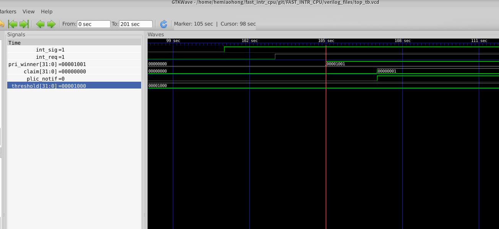

# Interrupt test

## 1. Interrupt entrance
The operating code is shown as below:

	_boot:                   
	addi x1 , x0,   16  /* x1  = 0x10 */
	slli x2 , x1,   8  /* x2  = 0x1000 */
	slli x3 , x1,   17  /* x3  = 0x200000 */
	slli x1 , x1,   16  /* x1  = 0x100000 */
	add  x3 , x1, x3 /*x3 = 0x3000000*/
	add  x4, x1 , x2 /*x4 = 0x101000*/
	add  x5, x4 , x2 /*x5 = 0x102000*/
	addi x4, x0 ,  72
	csrrs x4, mtvec, x4 /*trap vector=0x48, correspondingly the pc of _trap_handle*/
	sw   x2, 0(x3)/* Threshold set to 0x1000*/
	addi x6, x2 ,  1
	addi x2, x2 , -1
	sw   x6, 4(x1)/*priority of intr_1 is 0x1001*/
	sw   x2, 8(x1)/*priority of intr_2 is 0xfff*/
	sw   x2, 0(x5)/*enable set to 0xfff*/
	j _boot
	addi x7, x0, 456
	addi x7, x0, 456
	
	_trap_handle:
	lw	 x6, 4(x3)/*pc=0x48*/
	_f1:
	addi x7, x0, 123
	addi x7, x0, 123
	addi x7, x0, 123
	j _f1

The test case is constructed by following steps:

boot:

1. set trap vector( mtvec ) to 0x48, which is the starting place of trap handler
2. write a series of PLIC registers by sw(save word) instructions including enable, priority, threshold
3. loop until interrupt happens

trap_handle:

	1. read claim register in PLIC
	1. loop until simulation end

With the compilation above, we can get result shown in figures. When external interrupt signal happens, in PLIC, gateway transfer signal into a request toward PLIC core. Then, the pending register bit of corresponding interrupt will be set high. With the pull up of pending signal, the winner will be written into the claim register if the priority of winner is higher than threshold. At the same time, a notification will be sent to pipeline.

When pipeline received the notification of PLIC, a new designed block will do a series of action to enter trap handler. Firstly, the mip CSR will be pull high. Mie, mip and mstatus will be checked if the interrupt can happen. If it is allowed,  the flush signal will be sent to all stages of pipeline except WB and the base address will be sent to IF stage to enter trap vector. Also at the same time of flushing pipeline, mstatus and mepc will change their velue according to the spec.

As a first step of trap handler(only in this program), pipeline read claim to know which source of interrupt it is. Also, the read behavior of claim register will tell PLIC to clear the pending of corresponding source.

## 2. Return from handler

The return from trap handling program is done by mret instruction. When mret is decoded, a redirection of pc will be done to go back to non-trap environment( context before interrupt). As shown in the figure, with flushing of one instruction, pc will be redirected to 0x2c, which is the pc of interrupted instruction. Also mstatus has go back to initial value after the commit of mret( at commit stage in order to prevent unexpected problem like another interrupt)

At the same time , another problem is not solved yet. Mepc CSR preserve the pc in mem stage when interrupt happens in order to go back to the correct place when quit interrupt handling. But if the instruction in mem stage is a flushed instruction or stalled instruction, the quit of interrupt handling will cause incorrect execution like the figure below. How should I solve the problem

