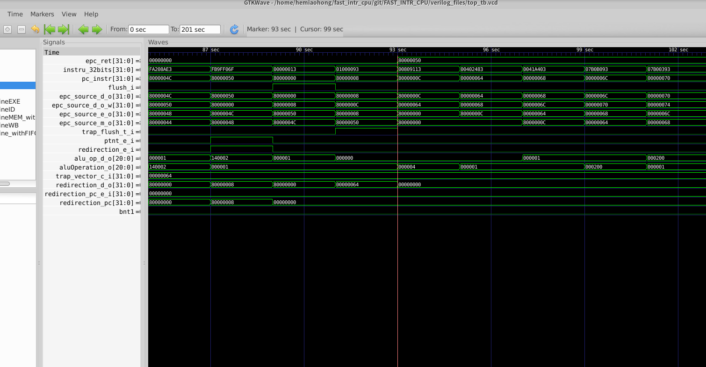
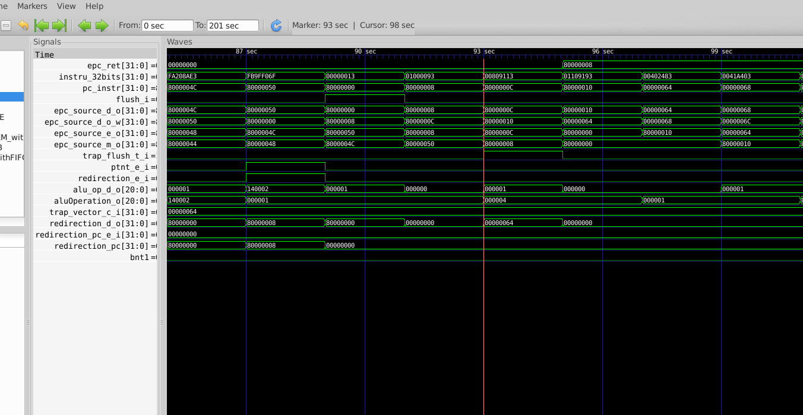
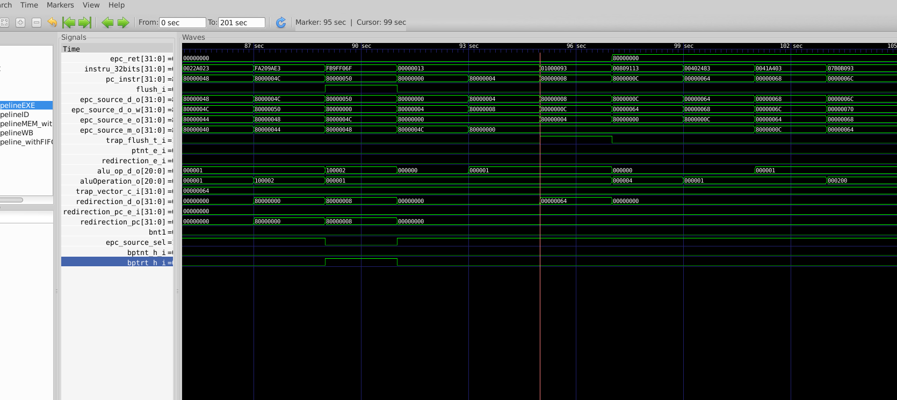
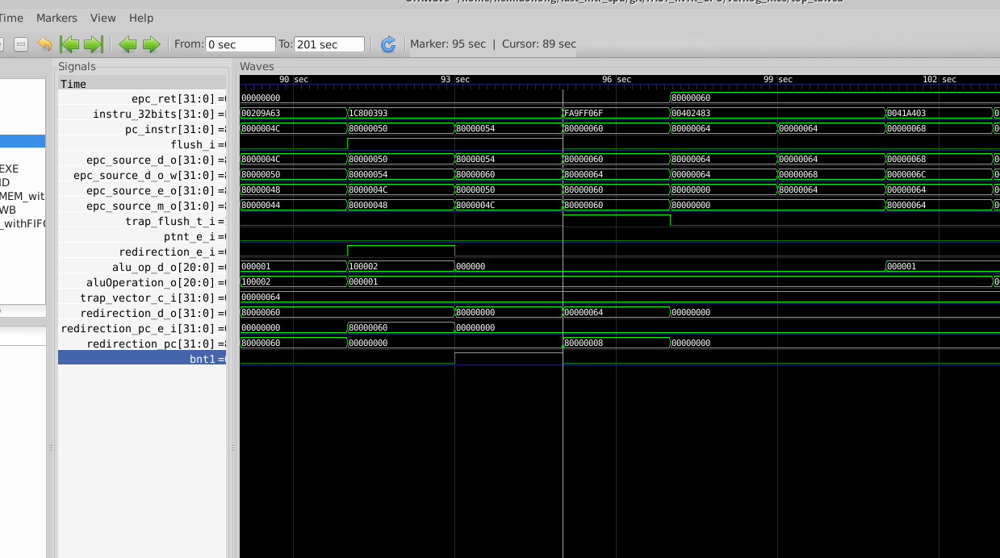
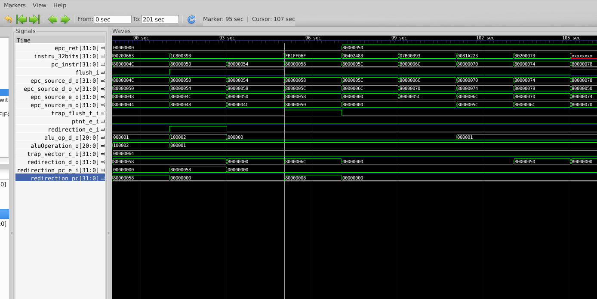
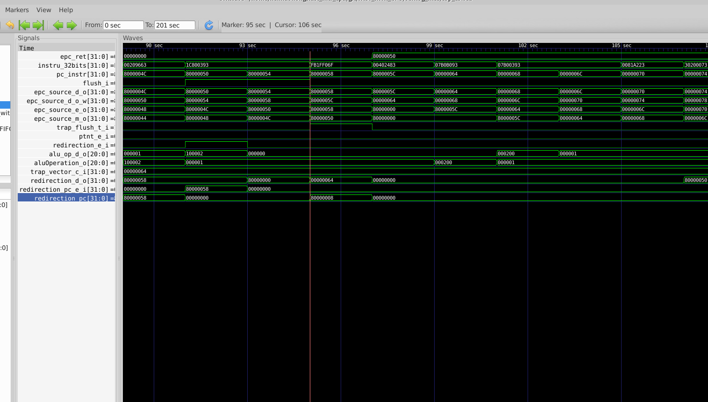

# Interrupt test

## 1. epc update when branch happen

When interrupt happens near branch, as is reported last week, the mepc CSR cannot get correct position(i.e. PC) to go back when trap handling finish. 

(1) predicted taken but not taken

The instruction flow can be described as follow:

	_boot:     
		xxx
		xxx
	_f1:
		xxx
		xxx
		beq _f1
		jal _boot
The beq instruction will be predicted taken but is actually not taken. As a consequence, both beq and jal will affect redirection place causing a chaotic situation of redirection. By adding logic of epc selection in  EX stage, both jump and branch will not affect the result

(2) predicted taken and true

The instruction flow can be described as follow:

	_boot:     
		xxx
		xxx
	_f1:
		xxx
		xxx
		bne 

The bne instruction will be predicted taken and is actually taken. With similar method, the epc will get correct PC.

(3) predicted not taken but taken

The instruction flow can be described as follow:

	_boot:     
		xxx
		xxx
		bne
	    xxx
		xxx
	_f1:
		xxx

The bne instruction will be predicted not taken but is actually taken. This kind of situation results in a 2-clock flush in pipeline. So, in such case, extra logic will be added in MEM stage to get correct epc.

## 2. redirection bug when interrupt happen

As is shown in the figure above, after trap happened, the pc goes to 0x6c. But the correct trap vector should be 0x64. The problem figures out to be that jal instruction also caused a redirection and the two redirection did an OR operation because of the wrong redirection_pc generation logic. By putting the trap redirection pc and normal redirection pc into a MUX, the problem fixed. Result is shown as below.

## 3. other work

1. discovered a jump bug, reported to Fu Jie, waiting for further solution
2. merge RTL codes